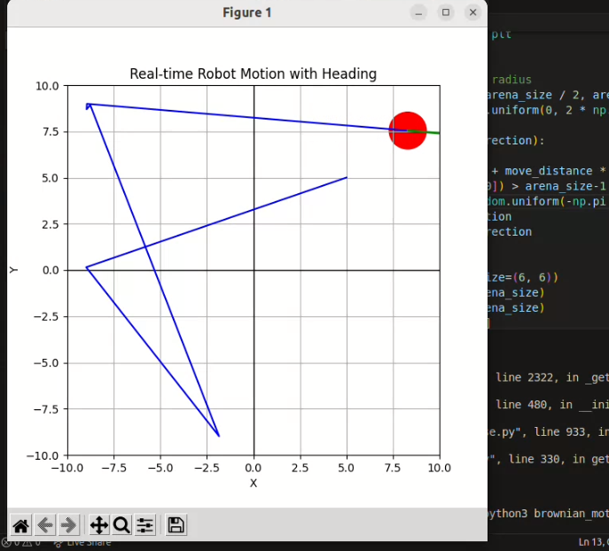

(All project vidoes are inside of folder download and view )
Robotics Projects and Experiments

Welcome! This repository contains a collection of robotics and simulation experiments I've been working on. The work is organized into distinct tasks, each demonstrating various aspects of computer vision, path planning, and ROS-based robot navigation.

🚗 Task 1: Line Following Robot (Robot Academy)

Description:
Developed a simple line-following robot using OpenCV.

Key Features:

Detected red path using masking in OpenCV.

Applied proportional control (P) to adjust robot's heading.

Used custom boundaries in BGR to segment the line.

Error correction based on image centroid and path.

Notes:

PID control was partially implemented (P-term only).

GUI and HAL modules were used for visual feedback and movement control.

📸 Optionally insert an image of masked output or robot following line here.

🌀 Task 2: Brownian Motion Simulation

Description:
Simulated a robot performing random movements (Brownian motion) in a 2D space.

Tools Used:

Standard Python

NumPy

Matplotlib

Behavior:

Robot moves randomly in a square arena.

On hitting walls, it changes to a new random direction.

Motion visualized in real-time using matplotlib.

🎥 Optional: insert gif or mp4 or link to video demo.

🤖 Task 3: ROS2-based Robot Navigation

Part A: Talker and Listner Nodes with Rviz laser view 

Developed a ROS2 listener node to process data.

Viewed and interpreted live LaserScan data of TurtleBot3.

Part B: Custom Parking Simulation

Description:
Working on a personal project involving autonomous parking simulation.

Highlights:

Loaded custom SDF world with a car model.

Attached a camera to the rear of the car.

Using SLAM Toolbox and RPLiDAR S2 to improve autonomous parking.

Work in Progress:

Improving navigation logic.

Enhancing launch files for better integration.

📷 Insert rear-camera view or parking sim screenshot.

📌 How to Run

Instructions for running each task (scripts, dependencies, etc.) will be added soon.

🛠 Dependencies

OpenCV

NumPy

Matplotlib

ROS2 (Humble/Foxy)

SLAM Toolbox

🎯 Upcoming Goals

Add full PID controller to the line follower.

Integrate RViz2 for visualization.

Add real hardware testing video.

Improve car navigation and mapping with better tuning.

Feel free to fork, clone, or raise issues if you want to discuss improvements!

